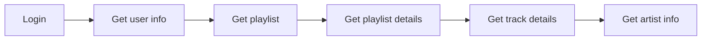

# Quizz App

## Device / Game controller
- Answer with the smartphone

## Simple question
- User can create a quizz with multiple question
- Players can access quizz to answer each question

## Guess the Year
- User can start a game session by linking with his spotify account
- Players try to guess which year the song is 

## Tools
- For design, i use [Radix UI](https://www.radix-ui.com/)
- To build app on mobile, i use [Capacitor](https://capacitorjs.com/)

## Workflows

1) get user info by SDK deezer login (userId, name, picture)
2) get Playlist of the loged user by userId (playlistId, playlistName, playlistPicture)
3) get Playlist details by playlistId (tracks & trackId)
4) get Track details by trackId (trackName, trackPicture, trackArtist, trackAlbum, trackReleaseDate) -> There i get the preview url
5) optionnal: get artist info

