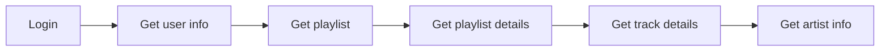

# Quizz App - How old are you ?

## Description
This app is a quizz game where you have to guess the year of a song.
If you are wrong, you will see how many years you are from the correct answer.
The years representes your age in the game.
The goal is to have the lowest score possible, so to be the youngest.

## Guess the Year
- User can start a game session by linking with his deezer account
- Players try to guess which year the song is 
- On each wrong answer, a counter is incremented, it's represented years from the correct answer

## Game modes
- Dedicated playlist (user can choose a playlist) create by myself
- User login and choose a playlist from his deezer account

## Tools
- For design, i use [Radix UI](https://www.radix-ui.com/)
- To build app on mobile, i use [Capacitor](https://capacitorjs.com/)
- Router: [React Router](https://reactrouter.com/)
- State management: [Redux toolkit](https://redux-toolkit.js.org/)

## Workflows

1) get user info by SDK deezer login (userId, name, picture)
2) get Playlist of the loged user by userId (playlistId, playlistName, playlistPicture)
3) get Playlist details by playlistId (tracks & trackId)
4) get Track details by trackId (trackName, trackPicture, trackArtist, trackAlbum, trackReleaseDate) -> There i get the preview url
5) optionnal: get artist info

